# Ecosystem Overview

How the ForgeSworn building blocks fit together.

```mermaid
graph TB
    subgraph payments["L402 / Machine Payments"]
        tb[toll-booth]
        tba[toll-booth-announce]
        tbdvm[toll-booth-dvm]
        ann[402-announce]
        idx[402-indexer]
        pub[402-pub]
        mcp402[402-mcp]
        apx[aperture-announce]
        apxph[aperture-phoenixd]
    end

    subgraph spatial["Spatial / Meeting"]
        gh[geohash-kit]
        rk[rendezvous-kit]
        rmcp[rendezvous-mcp]
    end

    subgraph identity["Identity / Verification"]
        st[spoken-token]
        ck[canary-kit]
        nt[nsec-tree]
        ntcli[nsec-tree-cli]
        na[nostr-attestations]
    end

    subgraph crypto["Cryptographic Primitives"]
        rs[ring-sig]
        rp[range-proof]
        sw[shamir-words]
    end

    subgraph compliance["Compliance"]
        jk[jurisdiction-kit]
    end

    %% L402 pipeline
    tb --> tba
    tb --> tbdvm
    tba --> ann
    ann --> idx
    idx --> pub
    pub --> mcp402
    apx --> ann
    apxph -.-> apx

    %% Spatial chain
    gh --> rk
    rk --> rmcp

    %% Identity chain
    st --> ck
    nt --> ntcli
    na --> ck

    %% Crypto feeds into identity
    rs --> ck
    rp --> ck
    sw --> ck

    %% Compliance feeds into identity
    jk --> na

    %% Cross-category links
    ck -.->|attestations| na
    jk -.->|jurisdiction context| ck

    classDef paymentStyle fill:#1a1a2e,stroke:#e94560,color:#eee
    classDef spatialStyle fill:#1a1a2e,stroke:#0f3460,color:#eee
    classDef identityStyle fill:#1a1a2e,stroke:#16c79a,color:#eee
    classDef cryptoStyle fill:#1a1a2e,stroke:#f5a623,color:#eee
    classDef complianceStyle fill:#1a1a2e,stroke:#9b59b6,color:#eee

    class tb,tba,tbdvm,ann,idx,pub,mcp402,apx,apxph paymentStyle
    class gh,rk,rmcp spatialStyle
    class st,ck,nt,ntcli,na identityStyle
    class rs,rp,sw cryptoStyle
    class jk complianceStyle
```

## Categories

| Category | Repos | Entry point |
|:---------|:------|:------------|
| **L402 / Machine Payments** | 9 repos | [toll-booth](https://github.com/forgesworn/toll-booth) |
| **Spatial / Meeting** | 3 repos | [rendezvous-kit](https://github.com/forgesworn/rendezvous-kit) |
| **Identity / Verification** | 5 repos | [canary-kit](https://github.com/forgesworn/canary-kit) |
| **Cryptographic Primitives** | 3 repos | [ring-sig](https://github.com/forgesworn/ring-sig) |
| **Compliance** | 1 repo | [jurisdiction-kit](https://github.com/forgesworn/jurisdiction-kit) |

Arrows show dependency direction — downstream repos depend on upstream ones. Dotted lines show cross-category relationships.
