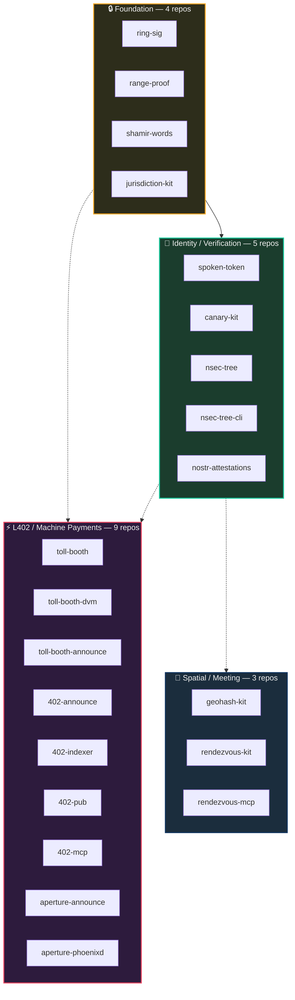
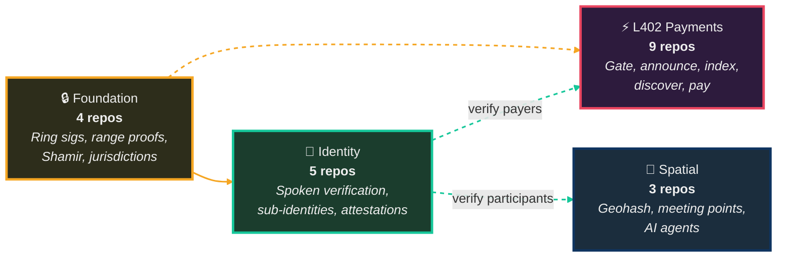

# Ecosystem Overview

How the ForgeSworn building blocks fit together. Three independent stacks built on a shared foundation of cryptographic primitives.

## System Context

## How the Stacks Connect

## Categories

| Category | Repos | Entry point | What it does |
|:---------|:-----:|:------------|:-------------|
| **⚡ L402 / Machine Payments** | 9 | [toll-booth](https://github.com/forgesworn/toll-booth) | Make any API payable via Lightning, announce it on Nostr, let AI agents find and consume it |
| **📍 Spatial / Meeting** | 3 | [rendezvous-kit](https://github.com/forgesworn/rendezvous-kit) | Geohash encoding, fair meeting point computation, MCP server for AI agents |
| **🔑 Identity / Verification** | 5 | [canary-kit](https://github.com/forgesworn/canary-kit) | Spoken verification, duress detection, deterministic Nostr identities, verifiable attestations |
| **🔒 Foundation** | 4 | [ring-sig](https://github.com/forgesworn/ring-sig) | Ring signatures, range proofs, Shamir secret sharing, jurisdiction intelligence |

**Drill down:** [L402 pipeline](l402-pipeline.md) | [Identity stack](identity-stack.md)
