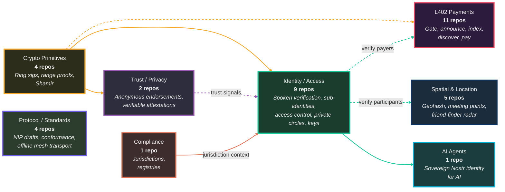

# Ecosystem Overview

How the ForgeSworn building blocks fit together. Built from the inside out: audited cryptographic primitives at the core, protocol libraries in the middle, user-facing applications at the edge.

## System Context

```mermaid
graph TB
    subgraph payments["L402 / Machine Payments -- 11 repos"]
        direction LR
        p1["toll-booth"]
        p2["toll-booth-dvm"]
        p3["toll-booth-announce"]
        p4["402-announce"]
        p5["402-indexer"]
        p6["402-pub"]
        p7["402-mcp"]
        p8["aperture-announce"]
        p9["aperture-phoenixd"]
        p10["toll-booth-mcp"]
        p11["payment-methods"]
    end

    subgraph spatial["Spatial / Meeting -- 5 repos"]
        direction LR
        s1["geohash-kit"]
        s2["rendezvous-kit"]
        s3["rendezvous-mcp"]
        s4["flock-kit"]
        s5["capacitor-mesh-ble"]
    end

    subgraph identity["Identity / Access -- 9 repos"]
        direction LR
        i1["spoken-token"]
        i2["canary-kit"]
        i3["nsec-tree"]
        i4["nsec-tree-cli"]
        i5["signet"]
        i6["dominion"]
        i7["covey-kit"]
        i8["roost-kit"]
        i9["keystore-kit"]
    end

    subgraph agents["AI Agents -- 1 repo"]
        direction LR
        a1["bray"]
    end

    subgraph trust["Trust / Privacy -- 2 repos"]
        direction LR
        t1["nostr-veil"]
        t2["nostr-attestations"]
    end

    subgraph foundation["Cryptographic Primitives -- 4 repos"]
        direction LR
        f1["ring-sig"]
        f2["range-proof"]
        f3["shamir-core"]
        f4["shamir-words"]
    end

    subgraph compliance["Compliance -- 1 repo"]
        direction LR
        c1["jurisdiction-kit"]
    end

    subgraph protocol["Protocol / Standards -- 4 repos"]
        direction LR
        pr1["nip-drafts"]
        pr2["trott-conformance"]
        pr3["mesh-kit"]
        pr4["mesh-nostr-kit"]
    end

    foundation --> identity
    foundation --> trust
    foundation -.-> payments
    identity -.-> payments
    identity -.-> spatial
    identity --> agents
    trust -.-> identity
    compliance --> identity

    click p1 "https://github.com/forgesworn/toll-booth" _blank
    click p2 "https://github.com/forgesworn/toll-booth-dvm" _blank
    click p3 "https://github.com/forgesworn/toll-booth-announce" _blank
    click p4 "https://github.com/forgesworn/402-announce" _blank
    click p5 "https://github.com/forgesworn/402-indexer" _blank
    click p6 "https://github.com/forgesworn/402-pub" _blank
    click p7 "https://github.com/forgesworn/402-mcp" _blank
    click p8 "https://github.com/forgesworn/aperture-announce" _blank
    click p9 "https://github.com/forgesworn/aperture-phoenixd" _blank
    click p10 "https://github.com/forgesworn/toll-booth-mcp" _blank
    click p11 "https://github.com/forgesworn/payment-methods" _blank
    click s1 "https://github.com/forgesworn/geohash-kit" _blank
    click s2 "https://github.com/forgesworn/rendezvous-kit" _blank
    click s3 "https://github.com/forgesworn/rendezvous-mcp" _blank
    click i1 "https://github.com/forgesworn/spoken-token" _blank
    click i2 "https://github.com/forgesworn/canary-kit" _blank
    click i3 "https://github.com/forgesworn/nsec-tree" _blank
    click i4 "https://github.com/forgesworn/nsec-tree-cli" _blank
    click i5 "https://github.com/forgesworn/signet" _blank
    click i6 "https://github.com/forgesworn/dominion" _blank
    click a1 "https://github.com/forgesworn/bray" _blank
    click t1 "https://github.com/forgesworn/nostr-veil" _blank
    click t2 "https://github.com/forgesworn/nostr-attestations" _blank
    click f1 "https://github.com/forgesworn/ring-sig" _blank
    click f2 "https://github.com/forgesworn/range-proof" _blank
    click f3 "https://github.com/forgesworn/shamir-core" _blank
    click f4 "https://github.com/forgesworn/shamir-words" _blank
    click c1 "https://github.com/forgesworn/jurisdiction-kit" _blank
    click pr1 "https://github.com/forgesworn/nip-drafts" _blank
    click pr2 "https://github.com/forgesworn/trott-conformance" _blank
    click s4 "https://github.com/forgesworn/flock-kit" _blank
    click s5 "https://github.com/forgesworn/capacitor-mesh-ble" _blank
    click i7 "https://github.com/forgesworn/covey-kit" _blank
    click i8 "https://github.com/forgesworn/roost-kit" _blank
    click i9 "https://github.com/forgesworn/keystore-kit" _blank
    click pr3 "https://github.com/forgesworn/mesh-kit" _blank
    click pr4 "https://github.com/forgesworn/mesh-nostr-kit" _blank

    style payments fill:#2d1b3d,stroke:#e94560,color:#eee,stroke-width:2px
    style spatial fill:#1b2d3d,stroke:#0f3460,color:#eee,stroke-width:2px
    style identity fill:#1b3d2d,stroke:#16c79a,color:#eee,stroke-width:2px
    style agents fill:#1b3d3d,stroke:#00b4d8,color:#eee,stroke-width:2px
    style trust fill:#2d2d3d,stroke:#9b59b6,color:#eee,stroke-width:2px
    style foundation fill:#2d2d1b,stroke:#f5a623,color:#eee,stroke-width:2px
    style compliance fill:#3d2d2d,stroke:#e17055,color:#eee,stroke-width:2px
    style protocol fill:#2d3d2d,stroke:#6c5ce7,color:#eee,stroke-width:2px
```

## How the Stacks Connect

## Categories

| Category | Repos | Entry point | What it does |
|:---------|:-----:|:------------|:-------------|
| **L402 / Machine Payments** | 11 | [toll-booth](https://github.com/forgesworn/toll-booth) | Make any API payable via Lightning, announce it on Nostr, let AI agents find and consume it |
| **Spatial / Meeting** | 5 | [rendezvous-kit](https://github.com/forgesworn/rendezvous-kit) | Geohash encoding, fair meeting points, and flock's coercion-resistant friend-finder radar |
| **Identity / Access** | 9 | [nsec-tree](https://github.com/forgesworn/nsec-tree) | Spoken verification, duress detection, deterministic Nostr identities, encrypted access control, private circles, and on-device key protection |
| **AI Agents** | 1 | [bray](https://github.com/forgesworn/bray) | Sovereign Nostr identity and trust-aware tooling for AI agents |
| **Trust / Privacy** | 2 | [nostr-veil](https://github.com/forgesworn/nostr-veil) | Anonymous trust assertions, verifiable attestations |
| **Cryptographic Primitives** | 4 | [ring-sig](https://github.com/forgesworn/ring-sig) | Ring signatures, range proofs, Shamir secret sharing |
| **Compliance** | 1 | [jurisdiction-kit](https://github.com/forgesworn/jurisdiction-kit) | Professional body registries and jurisdiction intelligence |
| **Protocol / Standards** | 4 | [nip-drafts](https://github.com/forgesworn/nip-drafts) | Nostr protocol extensions, conformance testing, and transport-agnostic offline mesh |

**Drill down:** [L402 pipeline](l402-pipeline.md) | [Identity stack](identity-stack.md)
