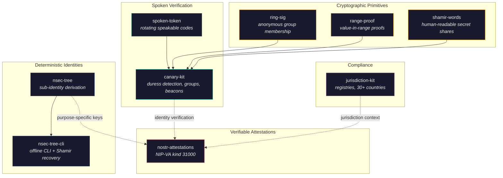

# Identity Stack

Spoken verification, deterministic identities, verifiable attestations, and privacy-preserving cryptography.

## Layers

### Spoken Verification

**[spoken-token](https://github.com/forgesworn/spoken-token)** — TOTP, but you say it out loud. Derives time-rotating, human-speakable verification tokens from a shared secret. Zero dependencies.

**[canary-kit](https://github.com/forgesworn/canary-kit)** — builds on spoken-token with the CANARY protocol: per-member spoken words, silent duress detection (say a different word under coercion), encrypted group sync, location beacons, and dead man's switch liveness. Deepfake-proof because the tokens rotate and are never transmitted — you have to be present and alive.

### Deterministic Identities

**[nsec-tree](https://github.com/forgesworn/nsec-tree)** — one master Nostr secret, unlimited derived sub-identities. Each identity is deterministic and unlinkable. Use separate keys for roles, apps, bots, or privacy boundaries without managing separate seeds.

**[nsec-tree-cli](https://github.com/forgesworn/nsec-tree-cli)** — offline-first CLI for nsec-tree. Derive identities, generate proofs of common origin, and recover with Shamir shares.

### Verifiable Attestations

**[nostr-attestations](https://github.com/forgesworn/nostr-attestations)** — NIP-VA (kind 31000). One Nostr event kind for all attestations: credentials, endorsements, vouches, provenance, licensing, trust. Builders, parsers, and validators.

### Cryptographic Primitives

**[ring-sig](https://github.com/forgesworn/ring-sig)** — SAG and LSAG ring signatures on secp256k1. Prove you're in a group without revealing which member you are. LSAG adds linkability for double-spend/double-vote prevention.

**[range-proof](https://github.com/forgesworn/range-proof)** — Pedersen commitment range proofs on secp256k1. Prove a value is within a range without revealing the value. Useful for age verification, balance proofs, and threshold checks.

**[shamir-words](https://github.com/forgesworn/shamir-words)** — split secrets into human-readable BIP-39 word shares using Shamir's Secret Sharing over GF(256). Read your recovery share over the phone.

### Compliance

**[jurisdiction-kit](https://github.com/forgesworn/jurisdiction-kit)** — professional body registries and jurisdiction intelligence for 30+ countries. Feeds into attestations and identity-sensitive flows with compliance, data protection, and mutual recognition context.
