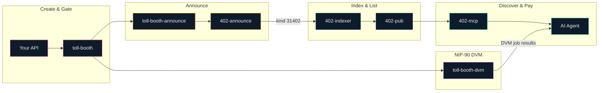

# L402 Pipeline

The full lifecycle of a Lightning-paid API: create, gate, announce, index, discover, pay, consume.

## The Pipeline

### 1. Gate your API

**[toll-booth](https://github.com/forgesworn/toll-booth)** wraps any HTTP endpoint with L402 authentication. One line of middleware — supports Express, Hono, Deno, Bun, and Workers. Connects to Phoenixd, LND, CLN, LNbits, or NWC for Lightning invoices.

### 2. Announce on Nostr

**[toll-booth-announce](https://github.com/forgesworn/toll-booth-announce)** reads your toll-booth config and passes it to **[402-announce](https://github.com/forgesworn/402-announce)**, which publishes kind `31402` parameterised replaceable events to Nostr relays.

Already running Aperture? **[aperture-announce](https://github.com/forgesworn/aperture-announce)** reads Aperture YAML and publishes the same kind `31402` events. **[aperture-phoenixd](https://github.com/forgesworn/aperture-phoenixd)** lets you use Phoenixd as the Lightning backend instead of LND.

### 3. Index and list

**[402-indexer](https://github.com/forgesworn/402-indexer)** crawls Nostr for kind `31402` events and builds a searchable index. **[402-pub](https://github.com/forgesworn/402-pub)** is the live directory at [402.pub](https://402.pub) — a static site streaming services from relays.

### 4. AI agents discover and pay

**[402-mcp](https://github.com/forgesworn/402-mcp)** is an MCP client that lets AI agents discover paid APIs from the directory, pay Lightning invoices, and consume the results — fully autonomous.

### 5. NIP-90 Data Vending Machines

**[toll-booth-dvm](https://github.com/forgesworn/toll-booth-dvm)** exposes any toll-booth-gated API as a NIP-90 DVM on Nostr, so clients can request jobs and receive results through the Nostr DVM protocol.
