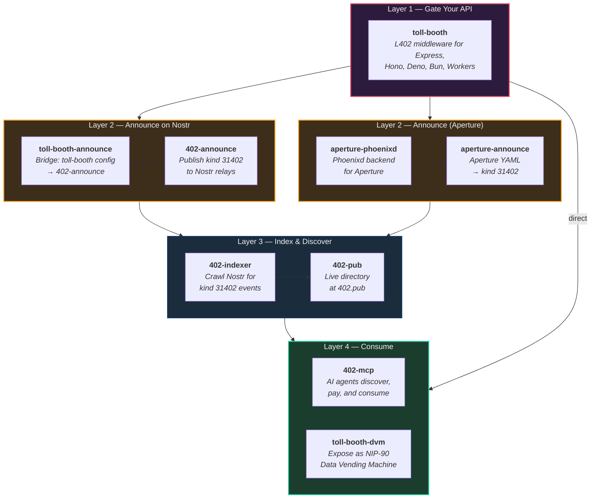

# L402 Pipeline

The full lifecycle of a Lightning-paid API: create, gate, announce, index, discover, pay, consume.

## Pipeline Overview

## The Layers

### Layer 1 — Gate Your API

**[toll-booth](https://github.com/forgesworn/toll-booth)** wraps any HTTP endpoint with L402 authentication. One line of middleware — supports Express, Hono, Deno, Bun, and Workers. Connects to Phoenixd, LND, CLN, LNbits, or NWC for Lightning invoices.

### Layer 2 — Announce on Nostr

Two paths depending on your setup:

- **toll-booth users:** **[toll-booth-announce](https://github.com/forgesworn/toll-booth-announce)** reads your config and passes it to **[402-announce](https://github.com/forgesworn/402-announce)**, which publishes kind `31402` events to Nostr relays.
- **Aperture users:** **[aperture-announce](https://github.com/forgesworn/aperture-announce)** reads Aperture YAML and publishes the same events. **[aperture-phoenixd](https://github.com/forgesworn/aperture-phoenixd)** lets you use Phoenixd instead of LND.

### Layer 3 — Index & Discover

**[402-indexer](https://github.com/forgesworn/402-indexer)** crawls Nostr for kind `31402` events and builds a searchable index. **[402-pub](https://github.com/forgesworn/402-pub)** is the live directory at [402.pub](https://402.pub).

### Layer 4 — Consume

- **[402-mcp](https://github.com/forgesworn/402-mcp)** — MCP client for AI agents to discover, pay, and consume paid APIs autonomously.
- **[toll-booth-dvm](https://github.com/forgesworn/toll-booth-dvm)** — expose any toll-booth-gated API as a NIP-90 Data Vending Machine on Nostr.

**Back to:** [Ecosystem overview](ecosystem-overview.md)
