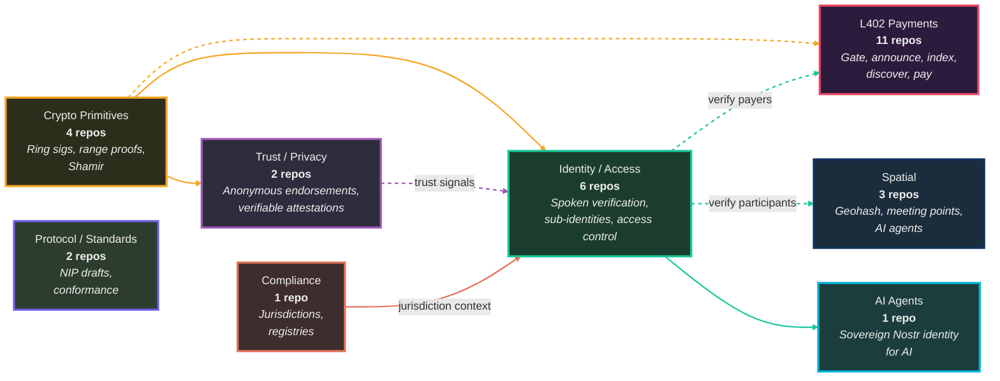
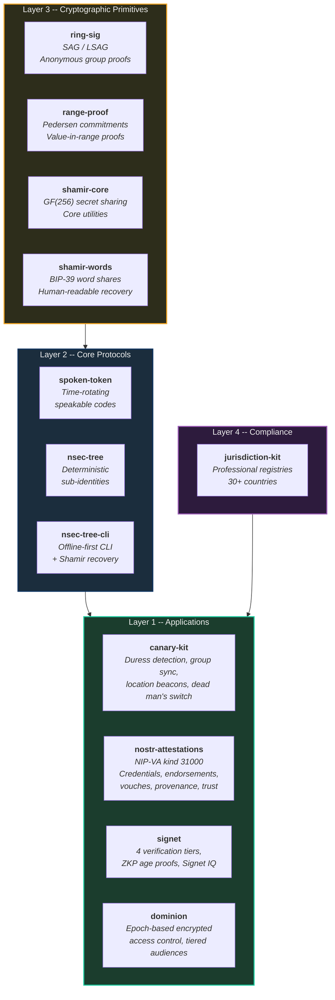
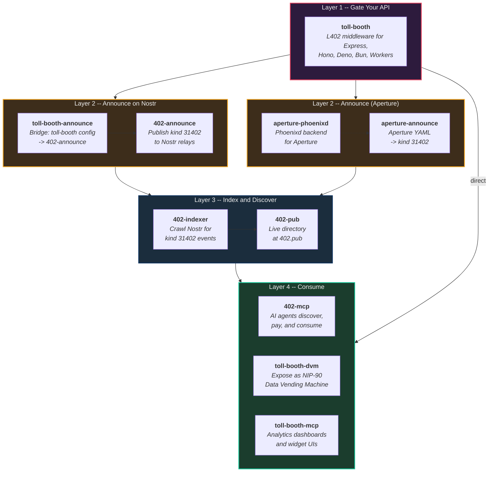

# ForgeSworn README Restructure Implementation Plan

> **For agentic workers:** REQUIRED SUB-SKILL: Use superpowers:subagent-driven-development (recommended) or superpowers:executing-plans to implement this plan task-by-task. Steps use checkbox (`- [ ]`) syntax for tracking.

**Goal:** Update the ForgeSworn GitHub org profile to reflect all 30 public repos across 8 categories, with updated Mermaid diagrams and a JSON manifest for the forgesworn.dev site.

**Architecture:** Five files to create/modify in the `forgesworn-github` repo. README rewrite, three Mermaid visual guides updated, one new JSON manifest. All content is static markdown and JSON -- no build step.

**Tech Stack:** Markdown, Mermaid diagrams, JSON

**Spec:** `docs/superpowers/specs/2026-03-27-readme-restructure-design.md`

---

### Task 1: Rewrite `profile/README.md`

**Files:**
- Modify: `profile/README.md` (full rewrite)

- [ ] **Step 1: Replace the full contents of `profile/README.md`**

```markdown
# ForgeSworn

Open-source building blocks for sovereign commerce, identity, and trust.

- Machine-payable APIs and Lightning payment gating
- Deterministic Nostr identities and encrypted access control
- Privacy-preserving trust and anonymous reputation
- Spoken verification, anti-deepfake, and coercion resistance
- Fair meeting points and spatial coordination
- AI agent tooling for sovereign Nostr interaction
- Cryptographic primitives: ring signatures, range proofs, Shamir secret sharing
- Nostr protocol extensions and conformance testing

Built on Nostr, Lightning, and zero-trust cryptography. Every repo works standalone or as a composable part of the ecosystem.

**Visual guides:** [Ecosystem overview](../docs/ecosystem-overview.md) | [L402 pipeline](../docs/l402-pipeline.md) | [Identity stack](../docs/identity-stack.md)

## Start Here

- **[toll-booth](https://github.com/forgesworn/toll-booth)**: Gate any HTTP API behind Lightning payments.
  Add **[toll-booth-announce](https://github.com/forgesworn/toll-booth-announce)**, **[402-announce](https://github.com/forgesworn/402-announce)**, **[402-indexer](https://github.com/forgesworn/402-indexer)**, and **[402-pub](https://github.com/forgesworn/402-pub)** for discovery. Add **[toll-booth-mcp](https://github.com/forgesworn/toll-booth-mcp)** for analytics and **[toll-booth-dvm](https://github.com/forgesworn/toll-booth-dvm)** for NIP-90 exposure.
- **[402-mcp](https://github.com/forgesworn/402-mcp)**: Let AI agents discover, pay for, and consume paid APIs.
  Pair with **[toll-booth](https://github.com/forgesworn/toll-booth)** and **[402-pub](https://github.com/forgesworn/402-pub)**.
- **[bray](https://github.com/forgesworn/bray)**: Give AI agents a sovereign Nostr identity.
  106 tools across identity, social, payments, moderation, and privacy. Built on **[nsec-tree](https://github.com/forgesworn/nsec-tree)** for identity derivation and **[dominion](https://github.com/forgesworn/dominion)** for encrypted access.
- **[nostr-veil](https://github.com/forgesworn/nostr-veil)**: Privacy-preserving Web of Trust.
  Anonymous trust assertions using LSAG ring signatures over NIP-85. Built on **[ring-sig](https://github.com/forgesworn/ring-sig)**.
- **[rendezvous-kit](https://github.com/forgesworn/rendezvous-kit)**: Build fair meeting-point or spatial apps.
  Add **[geohash-kit](https://github.com/forgesworn/geohash-kit)** and **[rendezvous-mcp](https://github.com/forgesworn/rendezvous-mcp)**.
- **[spoken-token](https://github.com/forgesworn/spoken-token)**: Add human-speakable rotating verification codes.
  Pair with **[canary-kit](https://github.com/forgesworn/canary-kit)**.
- **[nsec-tree](https://github.com/forgesworn/nsec-tree)**: Derive deterministic, unlinkable Nostr sub-identities from one master secret.
  Use it when one seed needs separate identities for roles, apps, bots, or privacy boundaries. Add **[nsec-tree-cli](https://github.com/forgesworn/nsec-tree-cli)** for an offline-first CLI. Used by **[bray](https://github.com/forgesworn/bray)** and **[signet](https://github.com/forgesworn/signet)**.
- **[canary-kit](https://github.com/forgesworn/canary-kit)**: Build spoken verification, duress detection, or privacy-preserving identity flows.
  Add **[ring-sig](https://github.com/forgesworn/ring-sig)**, **[range-proof](https://github.com/forgesworn/range-proof)**, and **[shamir-words](https://github.com/forgesworn/shamir-words)**.
- **[signet](https://github.com/forgesworn/signet)**: Decentralised identity verification for Nostr.
  4 verification tiers, ZKP age proofs, Signet IQ scoring. Built on **[nostr-attestations](https://github.com/forgesworn/nostr-attestations)** and **[range-proof](https://github.com/forgesworn/range-proof)**.
- **[dominion](https://github.com/forgesworn/dominion)**: Encrypted access control with epoch-based key rotation.
  Tiered audiences, HKDF content keys, Shamir secret sharing. Used by **[bray](https://github.com/forgesworn/bray)**.
- **[nostr-attestations](https://github.com/forgesworn/nostr-attestations)**: One Nostr event kind for all attestations (NIP-VA, kind 31000).
  Credentials, endorsements, vouches, provenance, licensing, and trust.
- **[jurisdiction-kit](https://github.com/forgesworn/jurisdiction-kit)**: Work with jurisdiction and professional-registry data.
  Pair with **[canary-kit](https://github.com/forgesworn/canary-kit)** or **[signet](https://github.com/forgesworn/signet)** for identity-sensitive flows.
- **[nip-drafts](https://github.com/forgesworn/nip-drafts)**: 30 Nostr protocol extensions covering service coordination, trust, payments, disputes, key hierarchy, and encrypted access.

## Common Flows

- `toll-booth -> toll-booth-announce -> 402-announce -> 402-indexer -> 402-pub -> 402-mcp`: Gate an API, announce it on Nostr, index it, publish a directory, let AI agents consume it.
- `toll-booth -> toll-booth-mcp`: Monitor a toll-booth with analytics dashboards and widget UIs.
- `geohash-kit -> rendezvous-kit -> rendezvous-mcp`: Encode spatial data, compute fair meeting points, expose to AI agents.
- `nsec-tree -> bray -> dominion`: Derive sub-identities, give them to an AI agent, gate content access by tier and epoch.
- `nsec-tree -> spoken-token / canary-kit`: Derive purpose-specific Nostr identities, attach spoken verification or higher-trust identity flows.
- `ring-sig -> nostr-veil`: Anonymous trust assertions -- prove group membership without revealing who endorsed.
- `nostr-attestations -> signet -> canary-kit / jurisdiction-kit`: Issue verifiable attestations, verify identities with tiers and ZKP age proofs, add jurisdiction context.
- `spoken-token -> canary-kit -> ring-sig / range-proof / shamir-words`: Spoken verification, privacy-preserving proofs, human-recoverable secret handling.
- `shamir-core -> shamir-words -> nsec-tree-cli`: Core secret sharing, BIP-39 word output, offline identity recovery.

## L402 / Machine Payments

Make APIs payable, discoverable, and consumable by people and agents.

Start with **[toll-booth](https://github.com/forgesworn/toll-booth)** to put a Lightning paywall in front of an API. Add announcement and indexing repos for discovery, then **[402-mcp](https://github.com/forgesworn/402-mcp)** when the client is an AI agent.

| Repository | What it does |
|:-----------|:-------------|
| **[toll-booth](https://github.com/forgesworn/toll-booth)** | Any API becomes a Lightning toll booth in one line. L402 middleware for Express, Hono, Deno, Bun, and Workers. |
| **[402-announce](https://github.com/forgesworn/402-announce)** | Announce HTTP 402 services on Nostr for decentralised discovery using kind `31402` parameterised replaceable events. |
| **[402-mcp](https://github.com/forgesworn/402-mcp)** | MCP client for AI agents to discover, pay for, and consume L402 and x402 APIs. |
| **[402-pub](https://github.com/forgesworn/402-pub)** | [402.pub](https://402.pub) ecosystem landing page and live directory for Lightning-paid APIs. |
| **[toll-booth-announce](https://github.com/forgesworn/toll-booth-announce)** | Bridge between `toll-booth` and `402-announce` so a toll-booth service can be announced on Nostr. |
| **[toll-booth-dvm](https://github.com/forgesworn/toll-booth-dvm)** | Expose any toll-booth-gated API as a NIP-90 Data Vending Machine on Nostr. |
| **[toll-booth-mcp](https://github.com/forgesworn/toll-booth-mcp)** | MCP server with read-only analytics and widget UIs for toll-booth deployments. |
| **[402-indexer](https://github.com/forgesworn/402-indexer)** | Nostr-native crawler that discovers L402 and x402 paid APIs and publishes kind `31402` events. |
| **[payment-methods](https://github.com/forgesworn/payment-methods)** | Specifications for HTTP Payment Authentication methods (Lightning, Cashu, Session). |
| **[aperture-phoenixd](https://github.com/forgesworn/aperture-phoenixd)** | Use Phoenixd as the Lightning backend for Aperture, with no LND required. `Go` |
| **[aperture-announce](https://github.com/forgesworn/aperture-announce)** | Announce Aperture L402 services on Nostr for decentralised discovery. `Go` |

## Spatial / Meeting

Build location-aware workflows and fair meeting-point tools.

Start with **[rendezvous-kit](https://github.com/forgesworn/rendezvous-kit)** for meeting-point logic. Use **[geohash-kit](https://github.com/forgesworn/geohash-kit)** for geospatial primitives and Nostr location filters. Use **[rendezvous-mcp](https://github.com/forgesworn/rendezvous-mcp)** when you want that flow exposed to agents.

| Repository | What it does |
|:-----------|:-------------|
| **[geohash-kit](https://github.com/forgesworn/geohash-kit)** | Zero-dependency geohash toolkit for encoding, decoding, polygon coverage, and Nostr location filters. |
| **[rendezvous-kit](https://github.com/forgesworn/rendezvous-kit)** | Find fair meeting points for `N` participants with isochrone intersection, venue search, and fairness scoring. |
| **[rendezvous-mcp](https://github.com/forgesworn/rendezvous-mcp)** | MCP server for AI-driven fair meeting-point discovery. |

## Identity / Access

Build spoken verification, anti-deepfake, deterministic Nostr identity trees, encrypted access control, and decentralised identity verification.

Start with **[spoken-token](https://github.com/forgesworn/spoken-token)** for human-speakable rotating codes, **[nsec-tree](https://github.com/forgesworn/nsec-tree)** for deterministic unlinkable Nostr identities, **[signet](https://github.com/forgesworn/signet)** for multi-tier identity verification, or **[canary-kit](https://github.com/forgesworn/canary-kit)** for full spoken-verification flows with duress detection and group sync.

| Repository | What it does |
|:-----------|:-------------|
| **[spoken-token](https://github.com/forgesworn/spoken-token)** | TOTP, but you say it out loud. Derive time-rotating, human-speakable verification tokens from a shared secret. |
| **[nsec-tree](https://github.com/forgesworn/nsec-tree)** | Deterministic Nostr sub-identity derivation. One master secret, unlimited unlinkable identities. |
| **[nsec-tree-cli](https://github.com/forgesworn/nsec-tree-cli)** | Offline-first CLI for nsec-tree with derivation, proofs, and Shamir recovery. |
| **[canary-kit](https://github.com/forgesworn/canary-kit)** | Deepfake-proof identity verification with per-member spoken words, silent duress detection, encrypted group sync, and an open protocol. |
| **[signet](https://github.com/forgesworn/signet)** | Decentralised identity verification for Nostr. 4 verification tiers, ZKP age proofs, Signet IQ (0-200), professional verifier anti-corruption, verifier delegation. |
| **[dominion](https://github.com/forgesworn/dominion)** | Epoch-based encrypted access control. Your content. Your keys. Your rules. HKDF content keys per tier/epoch, AES-256-GCM, Shamir secret sharing, tiered audiences. |

## AI Agents

Give AI agents sovereign Nostr identities with trust-aware tooling.

| Repository | What it does |
|:-----------|:-------------|
| **[bray](https://github.com/forgesworn/bray)** | Trust-aware Nostr MCP for AI and humans. 106 tools across 13 groups: identity (nsec-tree derivation, personas), social (DMs, notifications, Blossom), payments, moderation, privacy (NIP-17), and encrypted access (Dominion). Three trust dimensions: Verification, Proximity, and Access. |

## Trust / Privacy

Privacy-preserving trust and verifiable attestations.

| Repository | What it does |
|:-----------|:-------------|
| **[nostr-veil](https://github.com/forgesworn/nostr-veil)** | Anonymous trust assertions for Nostr. LSAG ring signatures over NIP-85 so endorsements are verifiable but contributors are unidentifiable. Solves the Trust Trilemma. |
| **[nostr-attestations](https://github.com/forgesworn/nostr-attestations)** | One Nostr event kind for all attestations -- credentials, endorsements, vouches, provenance, licensing, and trust. NIP-VA (kind 31000). |

## Cryptographic Primitives

Standalone cryptographic building blocks used across the ecosystem.

| Repository | What it does |
|:-----------|:-------------|
| **[ring-sig](https://github.com/forgesworn/ring-sig)** | SAG and LSAG ring signatures on secp256k1 for proving group membership without revealing identity. |
| **[range-proof](https://github.com/forgesworn/range-proof)** | Pedersen commitment range proofs on secp256k1 for proving a value is in range without revealing it. |
| **[shamir-core](https://github.com/forgesworn/shamir-core)** | Shamir's Secret Sharing over GF(256) with core utilities. Backend for shamir-words. |
| **[shamir-words](https://github.com/forgesworn/shamir-words)** | Split secrets into human-readable BIP-39 word shares using Shamir's Secret Sharing. Built on shamir-core. |

## Compliance

Work with jurisdiction and professional-registry intelligence for regulated or identity-sensitive flows.

| Repository | What it does |
|:-----------|:-------------|
| **[jurisdiction-kit](https://github.com/forgesworn/jurisdiction-kit)** | Professional body registries and jurisdiction intelligence for 30+ countries, including compliance, data protection, and mutual recognition contexts. |

## Protocol / Standards

Nostr protocol extensions and conformance testing.

| Repository | What it does |
|:-----------|:-------------|
| **[nip-drafts](https://github.com/forgesworn/nip-drafts)** | 30 Nostr protocol extensions: service coordination, trust, payments, disputes, key hierarchy, resource curation, paid APIs, and encrypted access. Each NIP is independent. |
| **[trott-conformance](https://github.com/forgesworn/trott-conformance)** | Protocol conformance test suite. Lifecycle fixtures for TROTT task kinds. |
```

- [ ] **Step 2: Verify the README renders correctly**

Run: `cat profile/README.md | head -5`
Expected: The opening lines of the new README.

Count repos per section to verify totals:
- L402: 11 rows
- Spatial: 3 rows
- Identity: 6 rows
- AI Agents: 1 row
- Trust/Privacy: 2 rows
- Crypto: 4 rows
- Compliance: 1 row
- Protocol: 2 rows
- Total: 30

- [ ] **Step 3: Commit**

```bash
git add profile/README.md
git commit -m "docs: restructure org README for 30 public repos across 8 categories"
```

---

### Task 2: Update `docs/ecosystem-overview.md`

**Files:**
- Modify: `docs/ecosystem-overview.md` (full rewrite)

- [ ] **Step 1: Replace the full contents of `docs/ecosystem-overview.md`**

```markdown
# Ecosystem Overview

How the ForgeSworn building blocks fit together. Eight categories built on a shared foundation of cryptographic primitives.

## System Context

```mermaid
graph TB
    subgraph payments["L402 / Machine Payments -- 11 repos"]
        direction LR
        p1["toll-booth"]
        p2["toll-booth-dvm"]
        p3["toll-booth-announce"]
        p4["402-announce"]
        p5["402-indexer"]
        p6["402-pub"]
        p7["402-mcp"]
        p8["aperture-announce"]
        p9["aperture-phoenixd"]
        p10["toll-booth-mcp"]
        p11["payment-methods"]
    end

    subgraph spatial["Spatial / Meeting -- 3 repos"]
        direction LR
        s1["geohash-kit"]
        s2["rendezvous-kit"]
        s3["rendezvous-mcp"]
    end

    subgraph identity["Identity / Access -- 6 repos"]
        direction LR
        i1["spoken-token"]
        i2["canary-kit"]
        i3["nsec-tree"]
        i4["nsec-tree-cli"]
        i5["signet"]
        i6["dominion"]
    end

    subgraph agents["AI Agents -- 1 repo"]
        direction LR
        a1["bray"]
    end

    subgraph trust["Trust / Privacy -- 2 repos"]
        direction LR
        t1["nostr-veil"]
        t2["nostr-attestations"]
    end

    subgraph foundation["Cryptographic Primitives -- 4 repos"]
        direction LR
        f1["ring-sig"]
        f2["range-proof"]
        f3["shamir-core"]
        f4["shamir-words"]
    end

    subgraph compliance["Compliance -- 1 repo"]
        direction LR
        c1["jurisdiction-kit"]
    end

    subgraph protocol["Protocol / Standards -- 2 repos"]
        direction LR
        pr1["nip-drafts"]
        pr2["trott-conformance"]
    end

    foundation --> identity
    foundation --> trust
    foundation -.-> payments
    identity -.-> payments
    identity -.-> spatial
    identity --> agents
    trust -.-> identity
    compliance --> identity

    click p1 "https://github.com/forgesworn/toll-booth" _blank
    click p2 "https://github.com/forgesworn/toll-booth-dvm" _blank
    click p3 "https://github.com/forgesworn/toll-booth-announce" _blank
    click p4 "https://github.com/forgesworn/402-announce" _blank
    click p5 "https://github.com/forgesworn/402-indexer" _blank
    click p6 "https://github.com/forgesworn/402-pub" _blank
    click p7 "https://github.com/forgesworn/402-mcp" _blank
    click p8 "https://github.com/forgesworn/aperture-announce" _blank
    click p9 "https://github.com/forgesworn/aperture-phoenixd" _blank
    click p10 "https://github.com/forgesworn/toll-booth-mcp" _blank
    click p11 "https://github.com/forgesworn/payment-methods" _blank
    click s1 "https://github.com/forgesworn/geohash-kit" _blank
    click s2 "https://github.com/forgesworn/rendezvous-kit" _blank
    click s3 "https://github.com/forgesworn/rendezvous-mcp" _blank
    click i1 "https://github.com/forgesworn/spoken-token" _blank
    click i2 "https://github.com/forgesworn/canary-kit" _blank
    click i3 "https://github.com/forgesworn/nsec-tree" _blank
    click i4 "https://github.com/forgesworn/nsec-tree-cli" _blank
    click i5 "https://github.com/forgesworn/signet" _blank
    click i6 "https://github.com/forgesworn/dominion" _blank
    click a1 "https://github.com/forgesworn/bray" _blank
    click t1 "https://github.com/forgesworn/nostr-veil" _blank
    click t2 "https://github.com/forgesworn/nostr-attestations" _blank
    click f1 "https://github.com/forgesworn/ring-sig" _blank
    click f2 "https://github.com/forgesworn/range-proof" _blank
    click f3 "https://github.com/forgesworn/shamir-core" _blank
    click f4 "https://github.com/forgesworn/shamir-words" _blank
    click c1 "https://github.com/forgesworn/jurisdiction-kit" _blank
    click pr1 "https://github.com/forgesworn/nip-drafts" _blank
    click pr2 "https://github.com/forgesworn/trott-conformance" _blank

    style payments fill:#2d1b3d,stroke:#e94560,color:#eee,stroke-width:2px
    style spatial fill:#1b2d3d,stroke:#0f3460,color:#eee,stroke-width:2px
    style identity fill:#1b3d2d,stroke:#16c79a,color:#eee,stroke-width:2px
    style agents fill:#1b3d3d,stroke:#00b4d8,color:#eee,stroke-width:2px
    style trust fill:#2d2d3d,stroke:#9b59b6,color:#eee,stroke-width:2px
    style foundation fill:#2d2d1b,stroke:#f5a623,color:#eee,stroke-width:2px
    style compliance fill:#3d2d2d,stroke:#e17055,color:#eee,stroke-width:2px
    style protocol fill:#2d3d2d,stroke:#6c5ce7,color:#eee,stroke-width:2px
```



## How the Stacks Connect



## Categories

| Category | Repos | Entry point | What it does |
|:---------|:-----:|:------------|:-------------|
| **L402 / Machine Payments** | 11 | [toll-booth](https://github.com/forgesworn/toll-booth) | Make any API payable via Lightning, announce it on Nostr, let AI agents find and consume it |
| **Spatial / Meeting** | 3 | [rendezvous-kit](https://github.com/forgesworn/rendezvous-kit) | Geohash encoding, fair meeting point computation, MCP server for AI agents |
| **Identity / Access** | 6 | [nsec-tree](https://github.com/forgesworn/nsec-tree) | Spoken verification, duress detection, deterministic Nostr identities, encrypted access control, decentralised identity verification |
| **AI Agents** | 1 | [bray](https://github.com/forgesworn/bray) | Sovereign Nostr identity and trust-aware tooling for AI agents |
| **Trust / Privacy** | 2 | [nostr-veil](https://github.com/forgesworn/nostr-veil) | Anonymous trust assertions, verifiable attestations |
| **Cryptographic Primitives** | 4 | [ring-sig](https://github.com/forgesworn/ring-sig) | Ring signatures, range proofs, Shamir secret sharing |
| **Compliance** | 1 | [jurisdiction-kit](https://github.com/forgesworn/jurisdiction-kit) | Professional body registries and jurisdiction intelligence |
| **Protocol / Standards** | 2 | [nip-drafts](https://github.com/forgesworn/nip-drafts) | 30 Nostr protocol extensions and conformance testing |

**Drill down:** [L402 pipeline](l402-pipeline.md) | [Identity stack](identity-stack.md)
```

- [ ] **Step 2: Commit**

```bash
git add docs/ecosystem-overview.md
git commit -m "docs: update ecosystem overview with 8 categories and 30 repos"
```

---

### Task 3: Update `docs/identity-stack.md`

**Files:**
- Modify: `docs/identity-stack.md` (full rewrite)

- [ ] **Step 1: Replace the full contents of `docs/identity-stack.md`**

```markdown
# Identity Stack

Spoken verification, deterministic identities, encrypted access control, decentralised identity verification, verifiable attestations, and privacy-preserving cryptography.

## Stack Overview



## The Layers

### Layer 1 -- Applications

**[canary-kit](https://github.com/forgesworn/canary-kit)** -- the CANARY protocol. Per-member spoken words, silent duress detection (say a different word under coercion), encrypted group sync, location beacons, and dead man's switch liveness. Deepfake-proof because the tokens rotate and are never transmitted -- you have to be present and alive.

**[nostr-attestations](https://github.com/forgesworn/nostr-attestations)** -- NIP-VA (kind 31000). One Nostr event kind for all attestations: credentials, endorsements, vouches, provenance, licensing, trust. Builders, parsers, and validators.

**[signet](https://github.com/forgesworn/signet)** -- decentralised identity verification for Nostr. Four verification tiers (self-declared, peer-vouched, professionally verified, institutionally certified), ZKP age proofs via range-proof, Signet IQ scoring (0-200), professional verifier anti-corruption mechanisms, and verifier delegation.

**[dominion](https://github.com/forgesworn/dominion)** -- epoch-based encrypted access control. Your content. Your keys. Your rules. HKDF content keys per tier/epoch, AES-256-GCM encryption, Shamir secret sharing for key recovery, and tiered audiences so you control exactly who can decrypt what.

### Layer 2 -- Core Protocols

**[spoken-token](https://github.com/forgesworn/spoken-token)** -- TOTP, but you say it out loud. Derives time-rotating, human-speakable verification tokens from a shared secret. Zero dependencies. The foundation canary-kit builds on.

**[nsec-tree](https://github.com/forgesworn/nsec-tree)** -- one master Nostr secret, unlimited derived sub-identities. Each identity is deterministic and unlinkable. Use separate keys for roles, apps, bots, or privacy boundaries without managing separate seeds.

**[nsec-tree-cli](https://github.com/forgesworn/nsec-tree-cli)** -- offline-first CLI for nsec-tree. Derive identities, generate proofs of common origin, and recover with Shamir shares.

### Layer 3 -- Cryptographic Primitives

**[ring-sig](https://github.com/forgesworn/ring-sig)** -- SAG and LSAG ring signatures on secp256k1. Prove you're in a group without revealing which member you are. LSAG adds linkability for double-spend/double-vote prevention.

**[range-proof](https://github.com/forgesworn/range-proof)** -- Pedersen commitment range proofs on secp256k1. Prove a value is within a range without revealing it. Age verification, balance proofs, threshold checks.

**[shamir-core](https://github.com/forgesworn/shamir-core)** -- Shamir's Secret Sharing over GF(256) with core splitting, combining, and verification utilities. The backend for shamir-words.

**[shamir-words](https://github.com/forgesworn/shamir-words)** -- split secrets into human-readable BIP-39 word shares using Shamir's Secret Sharing. Read your recovery share over the phone. Built on shamir-core.

### Layer 4 -- Compliance

**[jurisdiction-kit](https://github.com/forgesworn/jurisdiction-kit)** -- professional body registries and jurisdiction intelligence for 30+ countries. Feeds into attestations and identity-sensitive flows with compliance, data protection, and mutual recognition context.

**Back to:** [Ecosystem overview](ecosystem-overview.md)
```

- [ ] **Step 2: Commit**

```bash
git add docs/identity-stack.md
git commit -m "docs: add signet, dominion, shamir-core to identity stack diagram"
```

---

### Task 4: Update `docs/l402-pipeline.md`

**Files:**
- Modify: `docs/l402-pipeline.md` (full rewrite)

- [ ] **Step 1: Replace the full contents of `docs/l402-pipeline.md`**

```markdown
# L402 Pipeline

The full lifecycle of a Lightning-paid API: create, gate, announce, index, discover, pay, consume. Built on the [HTTP Payment Authentication](https://github.com/forgesworn/payment-methods) specifications for Lightning, Cashu, and Session payment methods.

## Pipeline Overview



## The Layers

### Layer 1 -- Gate Your API

**[toll-booth](https://github.com/forgesworn/toll-booth)** wraps any HTTP endpoint with L402 authentication. One line of middleware -- supports Express, Hono, Deno, Bun, and Workers. Connects to Phoenixd, LND, CLN, LNbits, or NWC for Lightning invoices.

### Layer 2 -- Announce on Nostr

Two paths depending on your setup:

- **toll-booth users:** **[toll-booth-announce](https://github.com/forgesworn/toll-booth-announce)** reads your config and passes it to **[402-announce](https://github.com/forgesworn/402-announce)**, which publishes kind `31402` events to Nostr relays.
- **Aperture users:** **[aperture-announce](https://github.com/forgesworn/aperture-announce)** reads Aperture YAML and publishes the same events. **[aperture-phoenixd](https://github.com/forgesworn/aperture-phoenixd)** lets you use Phoenixd instead of LND.

### Layer 3 -- Index and Discover

**[402-indexer](https://github.com/forgesworn/402-indexer)** crawls Nostr for kind `31402` events and builds a searchable index. **[402-pub](https://github.com/forgesworn/402-pub)** is the live directory at [402.pub](https://402.pub).

### Layer 4 -- Consume

- **[402-mcp](https://github.com/forgesworn/402-mcp)** -- MCP client for AI agents to discover, pay, and consume paid APIs autonomously.
- **[toll-booth-dvm](https://github.com/forgesworn/toll-booth-dvm)** -- expose any toll-booth-gated API as a NIP-90 Data Vending Machine on Nostr.
- **[toll-booth-mcp](https://github.com/forgesworn/toll-booth-mcp)** -- MCP server with read-only analytics and widget UIs for monitoring your toll-booth deployments.

**Back to:** [Ecosystem overview](ecosystem-overview.md)
```

- [ ] **Step 2: Commit**

```bash
git add docs/l402-pipeline.md
git commit -m "docs: add toll-booth-mcp and payment-methods to L402 pipeline"
```

---

### Task 5: Create `forgesworn-repos.json`

**Files:**
- Create: `forgesworn-repos.json`

- [ ] **Step 1: Create the JSON manifest at repo root**

The manifest contains all 30 public repos with category, description, GitHub URL, npm package, tags, and dependency relationships. Full content provided below (too large to inline here -- the implementing agent should write the complete file with all 30 repos following the schema from the spec).

Schema per repo:
```json
{
  "name": "repo-name",
  "github": "https://github.com/forgesworn/repo-name",
  "npm": "package-name or null",
  "description": "One-line description.",
  "tags": ["tag1", "tag2"],
  "dependsOn": ["upstream-repo"],
  "usedBy": ["downstream-repo"]
}
```

Categories and their repos:

**L402 / Machine Payments (slug: l402):** toll-booth, 402-announce, 402-mcp, 402-pub, toll-booth-announce, toll-booth-dvm, toll-booth-mcp, 402-indexer, payment-methods, aperture-phoenixd, aperture-announce

**Spatial / Meeting (slug: spatial):** geohash-kit, rendezvous-kit, rendezvous-mcp

**Identity / Access (slug: identity):** spoken-token, nsec-tree, nsec-tree-cli, canary-kit, signet, dominion

**AI Agents (slug: agents):** bray

**Trust / Privacy (slug: trust):** nostr-veil, nostr-attestations

**Cryptographic Primitives (slug: crypto):** ring-sig, range-proof, shamir-core, shamir-words

**Compliance (slug: compliance):** jurisdiction-kit

**Protocol / Standards (slug: protocol):** nip-drafts, trott-conformance

npm packages (from REPOS.md):
- toll-booth: `@forgesworn/toll-booth`
- 402-announce: `402-announce`
- 402-mcp: `402-mcp`
- 402-pub: `402-pub`
- toll-booth-announce: `toll-booth-announce`
- toll-booth-dvm: `toll-booth-dvm`
- toll-booth-mcp: null (check repo)
- 402-indexer: `402-indexer`
- payment-methods: null
- aperture-phoenixd: null (Go)
- aperture-announce: null (Go)
- geohash-kit: `geohash-kit`
- rendezvous-kit: `rendezvous-kit`
- rendezvous-mcp: `rendezvous-mcp`
- spoken-token: `spoken-token`
- nsec-tree: `nsec-tree`
- nsec-tree-cli: `nsec-tree-cli`
- canary-kit: `canary-kit`
- signet: null (check repo)
- dominion: `dominion-protocol`
- bray: null (check repo)
- nostr-veil: null (check repo)
- nostr-attestations: `nostr-attestations`
- ring-sig: `ring-sig`
- range-proof: `range-proof`
- shamir-core: null (check repo)
- shamir-words: `shamir-words`
- jurisdiction-kit: `jurisdiction-kit`
- nip-drafts: null
- trott-conformance: null

Dependency relationships (from REPOS.md dependency graph):
- toll-booth: usedBy [toll-booth-announce, toll-booth-dvm, toll-booth-mcp]
- toll-booth-announce: dependsOn [toll-booth, 402-announce]
- 402-announce: usedBy [toll-booth-announce, 402-indexer]
- 402-indexer: dependsOn [402-announce], usedBy [402-pub]
- 402-pub: dependsOn [402-indexer]
- 402-mcp: dependsOn [402-announce]
- toll-booth-dvm: dependsOn [toll-booth]
- toll-booth-mcp: dependsOn [toll-booth]
- aperture-announce: related to [aperture-phoenixd]
- geohash-kit: usedBy [rendezvous-kit]
- rendezvous-kit: dependsOn [geohash-kit], usedBy [rendezvous-mcp]
- rendezvous-mcp: dependsOn [rendezvous-kit]
- spoken-token: usedBy [canary-kit]
- canary-kit: dependsOn [spoken-token]
- nsec-tree: usedBy [nsec-tree-cli, bray, signet]
- nsec-tree-cli: dependsOn [nsec-tree]
- dominion: usedBy [bray]
- bray: dependsOn [nsec-tree, dominion]
- nostr-veil: dependsOn [ring-sig]
- nostr-attestations: usedBy [signet]
- signet: dependsOn [nostr-attestations, nsec-tree, range-proof]
- ring-sig: usedBy [nostr-veil, canary-kit]
- range-proof: usedBy [signet, canary-kit]
- shamir-core: usedBy [shamir-words]
- shamir-words: dependsOn [shamir-core], usedBy [nsec-tree-cli, canary-kit]

- [ ] **Step 2: Validate JSON**

Run: `node -e "JSON.parse(require('fs').readFileSync('forgesworn-repos.json', 'utf8')); console.log('Valid JSON')"`
Expected: `Valid JSON`

- [ ] **Step 3: Verify repo count**

Run: `node -e "const d = JSON.parse(require('fs').readFileSync('forgesworn-repos.json', 'utf8')); const count = d.categories.reduce((n, c) => n + c.repos.length, 0); console.log('Total repos:', count, count === 30 ? 'OK' : 'MISMATCH')"`
Expected: `Total repos: 30 OK`

- [ ] **Step 4: Commit**

```bash
git add forgesworn-repos.json
git commit -m "docs: add forgesworn-repos.json manifest for forgesworn.dev"
```

---

### Task 6: Final verification

- [ ] **Step 1: Verify all files are committed**

```bash
cd /Users/darren/WebstormProjects/forgesworn-github && git status
```

Expected: clean working tree.

- [ ] **Step 2: Count repos across README tables**

```bash
grep -c '^\| \*\*\[' profile/README.md
```

Expected: `30`

- [ ] **Step 3: Verify all GitHub links resolve**

Spot-check 3-4 new repos:
```bash
gh repo view forgesworn/bray --json name -q .name
gh repo view forgesworn/nostr-veil --json name -q .name
gh repo view forgesworn/signet --json name -q .name
gh repo view forgesworn/dominion --json name -q .name
```

Expected: each returns the repo name.
