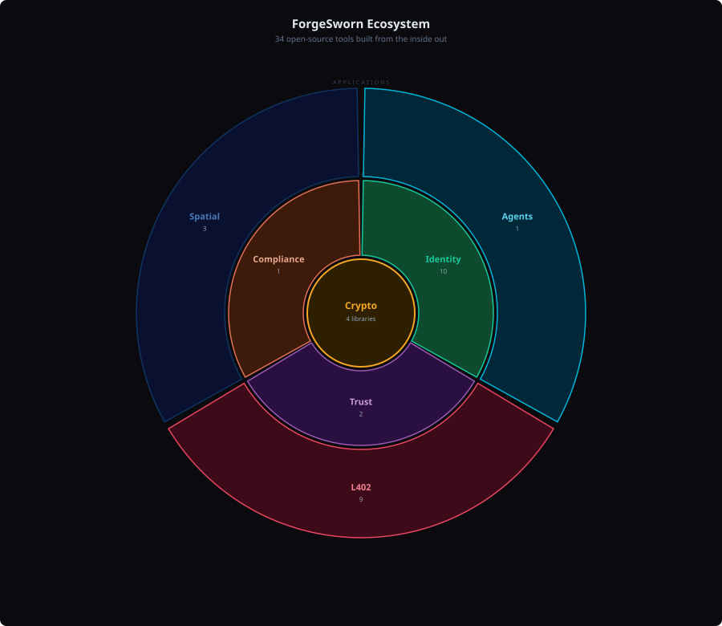

# ForgeSworn

Open-source building blocks for sovereign commerce, identity, and trust.

- Machine-payable APIs and Lightning payment gating
- Deterministic Nostr identities and encrypted access control
- Privacy-preserving trust and anonymous reputation
- Spoken verification, anti-deepfake, and coercion resistance
- Fair meeting points and spatial coordination
- AI agent tooling for sovereign Nostr interaction
- Cryptographic primitives: ring signatures, range proofs, Shamir secret sharing
- Nostr protocol extensions and conformance testing

Built on Nostr, Lightning, and zero-trust cryptography. Every repo works standalone or as a composable part of the ecosystem.

**Visual guides:** [Ecosystem overview](../docs/ecosystem-overview.md) | [L402 pipeline](../docs/l402-pipeline.md) | [Identity stack](../docs/identity-stack.md)

## Start Here

- **[toll-booth](https://github.com/forgesworn/toll-booth)**: Gate any HTTP API behind Lightning payments.
  Add **[toll-booth-announce](https://github.com/forgesworn/toll-booth-announce)**, **[402-announce](https://github.com/forgesworn/402-announce)**, **[402-indexer](https://github.com/forgesworn/402-indexer)**, and **[402-pub](https://github.com/forgesworn/402-pub)** for discovery. Add **[toll-booth-mcp](https://github.com/forgesworn/toll-booth-mcp)** for analytics and **[toll-booth-dvm](https://github.com/forgesworn/toll-booth-dvm)** for NIP-90 exposure. Use **[toll-booth-rs](https://github.com/forgesworn/toll-booth-rs)** for Rust.
- **[402-mcp](https://github.com/forgesworn/402-mcp)**: Let AI agents discover, pay for, and consume paid APIs.
  Pair with **[toll-booth](https://github.com/forgesworn/toll-booth)** and **[402-pub](https://github.com/forgesworn/402-pub)**.
- **[bray](https://github.com/forgesworn/bray)**: Give AI agents a sovereign Nostr identity.
  234 tools across identity, social, payments, dispatch, trust, moderation, privacy, spells, and encrypted access. Built on **[nsec-tree](https://github.com/forgesworn/nsec-tree)** for identity derivation and **[dominion](https://github.com/forgesworn/dominion)** for encrypted access.
- **[nostr-veil](https://github.com/forgesworn/nostr-veil)**: Privacy-preserving Web of Trust.
  Anonymous trust assertions using LSAG ring signatures over NIP-85. Built on **[ring-sig](https://github.com/forgesworn/ring-sig)**.
- **[rendezvous-kit](https://github.com/forgesworn/rendezvous-kit)**: Build fair meeting-point or spatial apps.
  Add **[geohash-kit](https://github.com/forgesworn/geohash-kit)** and **[rendezvous-mcp](https://github.com/forgesworn/rendezvous-mcp)**.
- **[spoken-token](https://github.com/forgesworn/spoken-token)**: Add human-speakable rotating verification codes.
  Pair with **[canary-kit](https://github.com/forgesworn/canary-kit)**.
- **[nsec-tree](https://github.com/forgesworn/nsec-tree)**: Derive deterministic, unlinkable Nostr sub-identities from one master secret.
  Use it when one seed needs separate identities for roles, apps, bots, or privacy boundaries. Add **[nsec-tree-cli](https://github.com/forgesworn/nsec-tree-cli)** for an offline-first CLI. Used by **[bray](https://github.com/forgesworn/bray)**, **[heartwood](https://github.com/forgesworn/heartwood)**, and **[signet](https://github.com/forgesworn/signet)**.
- **[heartwood](https://github.com/forgesworn/heartwood)**: Nostr signing software for Raspberry Pi.
  NIP-46 remote signing with Tor, AES-256-GCM encrypted storage, per-client kind permissions, and unlimited unlinkable personas from one mnemonic via **[nsec-tree](https://github.com/forgesworn/nsec-tree)**. Flash an SD card, boot, scan QR. `Rust`
- **[bark](https://github.com/forgesworn/bark)**: NIP-07 Nostr signer backed by NIP-46 remote signing.
  Self-sovereign keys, derived personas with **[heartwood](https://github.com/forgesworn/heartwood)**.
- **[canary-kit](https://github.com/forgesworn/canary-kit)**: Build spoken verification, duress detection, or privacy-preserving identity flows.
  Add **[ring-sig](https://github.com/forgesworn/ring-sig)**, **[range-proof](https://github.com/forgesworn/range-proof)**, and **[shamir-words](https://github.com/forgesworn/shamir-words)**.
- **[signet](https://github.com/forgesworn/signet)**: Decentralised identity verification for Nostr.
  4 verification tiers, ZKP age proofs, Signet IQ scoring. Built on **[nostr-attestations](https://github.com/forgesworn/nostr-attestations)** and **[range-proof](https://github.com/forgesworn/range-proof)**.
- **[dominion](https://github.com/forgesworn/dominion)**: Encrypted access control with epoch-based key rotation.
  Tiered audiences, HKDF content keys, Shamir secret sharing. Used by **[bray](https://github.com/forgesworn/bray)**.
- **[nostr-attestations](https://github.com/forgesworn/nostr-attestations)**: One Nostr event kind for all attestations (NIP-VA, kind 31000).
  Credentials, endorsements, vouches, provenance, licensing, and trust.
- **[jurisdiction-kit](https://github.com/forgesworn/jurisdiction-kit)**: Work with jurisdiction and professional-registry data.
  Pair with **[canary-kit](https://github.com/forgesworn/canary-kit)** or **[signet](https://github.com/forgesworn/signet)** for identity-sensitive flows.
- **[nip-drafts](https://github.com/forgesworn/nip-drafts)**: 29 Nostr protocol extensions covering service coordination, trust, payments, disputes, key hierarchy, and encrypted access.

## Common Flows

- `toll-booth -> toll-booth-announce -> 402-announce -> 402-indexer -> 402-pub -> 402-mcp`: Gate an API, announce it on Nostr, index it, publish a directory, let AI agents consume it.
- `toll-booth -> toll-booth-mcp`: Monitor a toll-booth with analytics dashboards and widget UIs.
- `geohash-kit -> rendezvous-kit -> rendezvous-mcp`: Encode spatial data, compute fair meeting points, expose to AI agents.
- `nsec-tree -> heartwood -> bark`: Derive sub-identities on a dedicated Pi, sign remotely via NIP-46 over Tor, use from the browser via NIP-07.
- `nsec-tree -> bray -> dominion`: Derive sub-identities, give them to an AI agent, gate content access by tier and epoch.
- `nsec-tree -> spoken-token / canary-kit`: Derive purpose-specific Nostr identities, attach spoken verification or higher-trust identity flows.
- `ring-sig -> nostr-veil`: Anonymous trust assertions -- prove group membership without revealing who endorsed.
- `nostr-attestations -> signet -> canary-kit / jurisdiction-kit`: Issue verifiable attestations, verify identities with tiers and ZKP age proofs, add jurisdiction context.
- `spoken-token -> canary-kit -> ring-sig / range-proof / shamir-words`: Spoken verification, privacy-preserving proofs, human-recoverable secret handling.
- `shamir-core -> shamir-words -> nsec-tree-cli`: Core secret sharing, BIP-39 word output, offline identity recovery.

## L402 / Machine Payments

Make APIs payable, discoverable, and consumable by people and agents.

Start with **[toll-booth](https://github.com/forgesworn/toll-booth)** to put a Lightning paywall in front of an API. Add announcement and indexing repos for discovery, then **[402-mcp](https://github.com/forgesworn/402-mcp)** when the client is an AI agent.

| Repository | What it does |
|:-----------|:-------------|
| **[toll-booth](https://github.com/forgesworn/toll-booth)** | Any API becomes a Lightning toll booth in one line. L402 middleware for Express, Hono, Deno, Bun, and Workers. |
| **[toll-booth-rs](https://github.com/forgesworn/toll-booth-rs)** | L402 payment middleware for Rust. Gates any HTTP API behind Lightning payments. `Rust` |
| **[402-announce](https://github.com/forgesworn/402-announce)** | Announce HTTP 402 services on Nostr for decentralised discovery using kind `31402` parameterised replaceable events. |
| **[402-mcp](https://github.com/forgesworn/402-mcp)** | MCP client for AI agents to discover, pay for, and consume L402 and x402 APIs. |
| **[402-pub](https://github.com/forgesworn/402-pub)** | [402.pub](https://402.pub) ecosystem landing page and live directory for Lightning-paid APIs. |
| **[toll-booth-announce](https://github.com/forgesworn/toll-booth-announce)** | Bridge between `toll-booth` and `402-announce` so a toll-booth service can be announced on Nostr. |
| **[toll-booth-dvm](https://github.com/forgesworn/toll-booth-dvm)** | Expose any toll-booth-gated API as a NIP-90 Data Vending Machine on Nostr. |
| **[toll-booth-mcp](https://github.com/forgesworn/toll-booth-mcp)** | MCP server with read-only analytics and widget UIs for toll-booth deployments. |
| **[402-indexer](https://github.com/forgesworn/402-indexer)** | Nostr-native crawler that discovers L402 and x402 paid APIs and publishes kind `31402` events. |
| **[payment-methods](https://github.com/forgesworn/payment-methods)** | Specifications for HTTP Payment Authentication methods (Lightning, Cashu, Session). |
| **[aperture-phoenixd](https://github.com/forgesworn/aperture-phoenixd)** | Use Phoenixd as the Lightning backend for Aperture, with no LND required. `Go` |
| **[aperture-announce](https://github.com/forgesworn/aperture-announce)** | Announce Aperture L402 services on Nostr for decentralised discovery. `Go` |

## Spatial / Meeting

Build location-aware workflows and fair meeting-point tools.

Start with **[rendezvous-kit](https://github.com/forgesworn/rendezvous-kit)** for meeting-point logic. Use **[geohash-kit](https://github.com/forgesworn/geohash-kit)** for geospatial primitives and Nostr location filters. Use **[rendezvous-mcp](https://github.com/forgesworn/rendezvous-mcp)** when you want that flow exposed to agents.

| Repository | What it does |
|:-----------|:-------------|
| **[geohash-kit](https://github.com/forgesworn/geohash-kit)** | Zero-dependency geohash toolkit for encoding, decoding, polygon coverage, and Nostr location filters. |
| **[rendezvous-kit](https://github.com/forgesworn/rendezvous-kit)** | Find fair meeting points for `N` participants with isochrone intersection, venue search, and fairness scoring. |
| **[rendezvous-mcp](https://github.com/forgesworn/rendezvous-mcp)** | MCP server for AI-driven fair meeting-point discovery. |

## Identity / Access

Build spoken verification, anti-deepfake, deterministic Nostr identity trees, encrypted access control, and decentralised identity verification.

Start with **[heartwood](https://github.com/forgesworn/heartwood)** for hardware-backed NIP-46 signing on a Raspberry Pi, **[nsec-tree](https://github.com/forgesworn/nsec-tree)** for deterministic unlinkable Nostr identities, **[spoken-token](https://github.com/forgesworn/spoken-token)** for human-speakable rotating codes, **[signet](https://github.com/forgesworn/signet)** for multi-tier identity verification, or **[canary-kit](https://github.com/forgesworn/canary-kit)** for full spoken-verification flows with duress detection and group sync.

| Repository | What it does |
|:-----------|:-------------|
| **[heartwood](https://github.com/forgesworn/heartwood)** | Nostr signing software for Raspberry Pi. NIP-46 remote signing, Tor by default, AES-256-GCM encrypted storage, per-client permissions, unlimited unlinkable personas via nsec-tree. `Rust` |
| **[bark](https://github.com/forgesworn/bark)** | NIP-07 Nostr signer backed by NIP-46 remote signing. Self-sovereign keys, derived personas with Heartwood. |
| **[spoken-token](https://github.com/forgesworn/spoken-token)** | TOTP, but you say it out loud. Derive time-rotating, human-speakable verification tokens from a shared secret. |
| **[nsec-tree](https://github.com/forgesworn/nsec-tree)** | Deterministic Nostr sub-identity derivation. One master secret, unlimited unlinkable identities. |
| **[nsec-tree-cli](https://github.com/forgesworn/nsec-tree-cli)** | Offline-first CLI for nsec-tree with derivation, proofs, and Shamir recovery. |
| **[canary-kit](https://github.com/forgesworn/canary-kit)** | Deepfake-proof identity verification with per-member spoken words, silent duress detection, encrypted group sync, and an open protocol. |
| **[signet](https://github.com/forgesworn/signet)** | Decentralised identity verification for Nostr. 4 verification tiers, ZKP age proofs, Signet IQ (0-200), professional verifier anti-corruption, verifier delegation. |
| **[dominion](https://github.com/forgesworn/dominion)** | Epoch-based encrypted access control. Your content. Your keys. Your rules. HKDF content keys per tier/epoch, AES-256-GCM, Shamir secret sharing, tiered audiences. |

## AI Agents

Give AI agents sovereign Nostr identities with trust-aware tooling.

| Repository | What it does |
|:-----------|:-------------|
| **[bray](https://github.com/forgesworn/bray)** | Trust-aware Nostr MCP for AI and humans. 234 tools across 22 groups: identity, social, trust, dispatch, relay, marketplace, safety, privacy, and encrypted access. NIP-A7 Spell casting. Three trust dimensions: Verification (Signet), Proximity (WoT), and Access (Dominion). |

## Trust / Privacy

Privacy-preserving trust and verifiable attestations.

| Repository | What it does |
|:-----------|:-------------|
| **[nostr-veil](https://github.com/forgesworn/nostr-veil)** | Anonymous trust assertions for Nostr. LSAG ring signatures over NIP-85 so endorsements are verifiable but contributors are unidentifiable. Solves the Trust Trilemma. |
| **[nostr-attestations](https://github.com/forgesworn/nostr-attestations)** | One Nostr event kind for all attestations -- credentials, endorsements, vouches, provenance, licensing, and trust. NIP-VA (kind 31000). |

## Cryptographic Primitives

Standalone cryptographic building blocks used across the ecosystem.

| Repository | What it does |
|:-----------|:-------------|
| **[ring-sig](https://github.com/forgesworn/ring-sig)** | SAG and LSAG ring signatures on secp256k1 for proving group membership without revealing identity. |
| **[range-proof](https://github.com/forgesworn/range-proof)** | Pedersen commitment range proofs on secp256k1 for proving a value is in range without revealing it. |
| **[shamir-core](https://github.com/forgesworn/shamir-core)** | Shamir's Secret Sharing over GF(256) with core utilities. Backend for shamir-words. |
| **[shamir-words](https://github.com/forgesworn/shamir-words)** | Split secrets into human-readable BIP-39 word shares using Shamir's Secret Sharing. Built on shamir-core. |

## Compliance

Work with jurisdiction and professional-registry intelligence for regulated or identity-sensitive flows.

| Repository | What it does |
|:-----------|:-------------|
| **[jurisdiction-kit](https://github.com/forgesworn/jurisdiction-kit)** | Professional body registries and jurisdiction intelligence for 30+ countries, including compliance, data protection, and mutual recognition contexts. |

## Protocol / Standards

Nostr protocol extensions and conformance testing.

| Repository | What it does |
|:-----------|:-------------|
| **[nip-drafts](https://github.com/forgesworn/nip-drafts)** | 29 Nostr protocol extensions: service coordination, trust, payments, disputes, key hierarchy, resource curation, paid APIs, and encrypted access. Each NIP is independent. |
| **[trott-conformance](https://github.com/forgesworn/trott-conformance)** | Protocol conformance test suite. Lifecycle fixtures for TROTT task kinds. |
